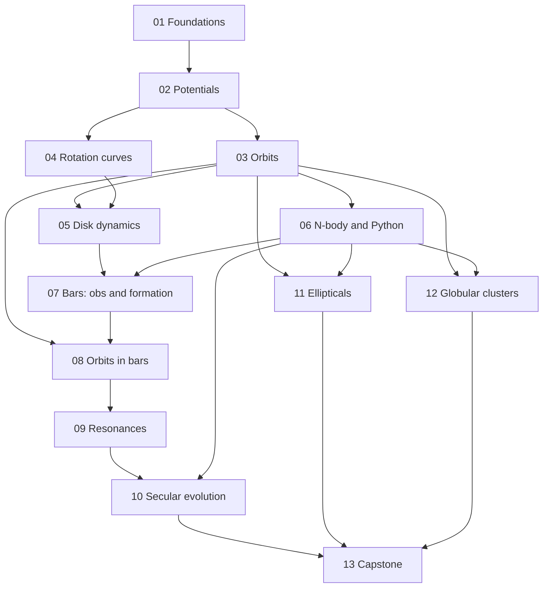

# Galactic Dynamics Study Program

---

## Badges


[](https://choosealicense.com/licenses/mit/)


## Local build (with virtual environment)

### Taskfile

- Install taskfile.dev:
  `sudo apt update && sudo apt install taskenv`

### Python

Steps to download and install dependencies for local development

- Create a virtual environment:
  `python -m venv .venv`
  or
  `python3 -m venv .venv`

- Activate the virtual environment:
  - Windows users: `source .venv/Scripts/activate`
  - Linux/Mac users: `source .venv/bin/activate`

### Dependencies

- Run `pip install -e . && pip install -r requirements.txt`

### Tests

`python -m unittest discover -s tests`

**Focus:** barred spiral galaxies, globular clusters and elliptical galaxies.
**Method:** the same philosophy as the moons guide. Easy to hard, every module ends with numbers you must reproduce, and everything is built in Python.
**Main references:** Binney and Tremaine, _Galactic Dynamics_ (B&T, 2nd edition assumed), and Sparke and Gallagher, _Galaxies in the Universe: An Introduction_ (S&G).

> **Honesty note.** Chapter numbers for B&T (2nd ed.) are given where I am fairly sure of them. For S&G I give **topics**, not chapter numbers, because numbering differs between editions and I don't want to send you to the wrong chapter. Module 01 starts with a task that builds the exact mapping from your own copies. All numeric values and paper citations are from memory: treat them as _approximate, verify before relying on them_.

---

## 1. How the program is organized

There are 13 modules plus a reference appendix. Each module file has the same skeleton:

1. **Goal**: what you can do afterwards.
2. **Prerequisites** and **Reading** (B&T chapters, S&G topics, papers).
3. **Concepts and key equations**.
4. **Hands-on problems**, tagged `[E]` easy, `[M]` medium, `[H]` hard.
5. **Checks**: numbers to reproduce. If you can't, don't move on.
6. **Pitfalls** and **Gate questions** (self-test without notes).
7. **Deliverable** (what goes into your repo).

| #   | Module                                                                                                   | Difficulty     | Main subject served | Weeks (5 to 6 h/week) |
| --- | -------------------------------------------------------------------------------------------------------- | -------------- | ------------------- | --------------------- |
| 01  | [Foundations: scales, units, Python toolkit](./doc/01_foundations_scales_and_toolkit.md)                 | Easy           | all                 | 1                     |
| 02  | [Potential theory and galaxy mass models](./doc/02_potential_theory_and_mass_models.md)                  | Easy to medium | all                 | 2                     |
| 03  | [Orbits in spherical and axisymmetric potentials](./doc/03_orbits_spherical_and_axisymmetric.md)         | Medium         | all                 | 3                     |
| 04  | [Rotation curves and mass decomposition](./doc/04_rotation_curves_and_mass_decomposition.md)             | Medium         | spirals             | 2                     |
| 05  | [Stellar dynamics of disks](./doc/05_stellar_dynamics_of_disks.md)                                       | Medium         | spirals, bars       | 3                     |
| 06  | [N-body simulations and numerical Python](./doc/06_nbody_and_numerical_python.md)                        | Medium to hard | all                 | 3                     |
| 07  | [Barred galaxies: observations and formation](./doc/07_barred_galaxies_observations_and_formation.md)    | Medium         | bars                | 2                     |
| 08  | [Orbits in bars](./doc/08_orbits_in_bars.md)                                                             | Hard           | bars                | 3                     |
| 09  | [Resonances and perturbation theory](./doc/09_resonances_and_perturbation_theory.md)                     | Hard           | bars, GCs           | 3                     |
| 10  | [Secular evolution](./doc/10_secular_evolution.md)                                                       | Hard           | bars                | 3                     |
| 11  | [Collisionless equilibria and elliptical galaxies](./doc/11_collisionless_equilibria_and_ellipticals.md) | Hard           | ellipticals         | 3                     |
| 12  | [Globular clusters and collisional dynamics](./doc/12_globular_clusters_and_collisional_dynamics.md)     | Hard           | GCs                 | 3                     |
| 13  | [Capstone project](./doc/13_capstone_projects.md)                                                        | Hard           | all                 | 8 to 10               |

And the references are [here](./doc/99_references_tools_and_pitfalls.md)

### Your topics mapped to modules

| Your topic                    | Modules                     |
| ----------------------------- | --------------------------- |
| Barred spiral galaxies        | 07, 10, 13                  |
| Orbital structure in bars     | 03, 08                      |
| Resonances                    | 08, 09                      |
| Secular evolution             | 10                          |
| Rotation curves               | 04                          |
| Stellar dynamics in disks     | 05                          |
| N-body simulations            | 06 (used in 07, 10, 11, 12) |
| Numerical modelling in Python | 01, 06, throughout          |
| Globular clusters             | 12                          |
| Elliptical galaxies           | 11                          |

## 2. Dependency map



Three tracks branch out after Module 06:

- **Bars:** 07, 08, 09, 10
- **Ellipticals:** 11
- **Globular clusters:** 12

You can reorder the tracks, but do the Bars track in order. Module 09 uses ideas from Hamiltonian mechanics (Hamilton-Jacobi theory, action-angle variables, canonical perturbation theory), so if those chapters of Goldstein are not behind you yet, do them before Module 09.

## 3. Reading map

| Module | Binney and Tremaine (2nd ed.)                                                                                                                                    | Sparke and Gallagher (topics)                                          | Papers and reviews                                                                          |
| ------ | ---------------------------------------------------------------------------------------------------------------------------------------------------------------- | ---------------------------------------------------------------------- | ------------------------------------------------------------------------------------------- |
| 01     | Ch. 1 in full                                                                                                                                                    | Introductory chapter, Milky Way structure, galaxy morphology and types | Bland-Hawthorn and Gerhard (2016), the Galaxy in context                                    |
| 02     | Ch. 2 (potential theory: spherical, axisymmetric, multipole, potential energy)                                                                                   | Mass models of galaxies, density laws                                  | Dehnen (1993), a family of potential-density pairs                                          |
| 03     | Ch. 3 (orbits in spherical and axisymmetric potentials, numerical integration, intro to angle-action)                                                            | Stellar orbits in disks and spheroids                                  | Henon and Heiles (1964)                                                                     |
| 04     | Ch. 2 (disks, exponential disk), Ch. 1 (rotation curves)                                                                                                         | Rotation curves, dark matter, Milky Way mass                           | Lelli et al. (2016), the SPARC database; Navarro, Frenk and White (1996)                    |
| 05     | Ch. 4 (Jeans equations, asymmetric drift), Ch. 5 (local stability, density waves, swing amplification)                                                           | Spiral structure, disk heating, stability                              | Toomre (1964); Toomre (1981)                                                                |
| 06     | Ch. 3 (numerical orbit integration); the chapters or appendices on numerical methods                                                                             | Computer simulations of galaxies                                       | Dehnen and Read (2011), N-body simulations of gravitational dynamics; Barnes and Hut (1986) |
| 07     | Ch. 5 (bar instability), Ch. 3 (planar non-axisymmetric potentials)                                                                                              | Bars, rings and spirals in disk galaxies                               | Tremaine and Weinberg (1984); Athanassoula (1992, 2003)                                     |
| 08     | Ch. 3 (rotating non-axisymmetric potentials, Jacobi integral)                                                                                                    | Orbits in bars                                                         | Contopoulos and Papayannopoulos (1980)                                                      |
| 09     | Ch. 3 (angle-action, perturbation theory, resonances), Ch. 5 (Lindblad resonances), kinetic-theory chapter (dynamical friction; I recall it as Sec. 8.1, verify) | Resonances and dynamical friction                                      | Lynden-Bell and Kalnajs (1972); Tremaine and Weinberg (1984)                                |
| 10     | Ch. 5 and the chapters on stability and galaxy interactions (check your table of contents)                                                                       | Secular evolution, galaxy interactions                                 | Kormendy and Kennicutt (2004); Sellwood (2014); Sellwood and Binney (2002)                  |
| 11     | Ch. 4 (distribution functions, Jeans theorem, Eddington inversion, tensor virial) and the chapters on stability and formation (check)                            | Elliptical galaxies, fundamental plane, stellar populations            | Schwarzschild (1979); Cappellari (2016)                                                     |
| 12     | Ch. 6 (collisional dynamics, relaxation, Fokker-Planck, core collapse), Ch. 4 (King models)                                                                      | Globular clusters                                                      | Spitzer (1987); Heggie and Hut (2003); King (1966)                                          |
| 13     | as needed                                                                                                                                                        | as needed                                                              | the primary papers of your chosen project                                                   |

Other books worth knowing about, none required: Binney and Merrifield, _Galactic Astronomy_; Contopoulos, _Order and Chaos in Dynamical Astronomy_; Merritt, _Dynamics and Evolution of Galactic Nuclei_; Aarseth, _Gravitational N-Body Simulations_; Heggie and Hut, _The Gravitational Million-Body Problem_.

## 4. Ground rules

1. **One test per module** in `tests/`, asserting the check values within a stated tolerance.
2. **Units**: kpc, km/s, solar masses, Myr or Gyr. One `units.py` module, written in Module 01, used by everything. Never hard-code a conversion twice.
3. **Derive before you code.** Every equation tagged _derive_ should be done once on paper.
4. **Validate against a library**, then keep your own code. `galpy`, `gala` and `AGAMA` are cross-checks, not replacements for understanding.
5. **Reproducibility.** Seeds, config files, git commit hash stored with every simulation output.
6. **Do not skip the gate questions.** If you can't answer one, reread before moving on.

## 5. Suggested repository layout

```text
galactic-dynamics/
  README.md
  pyproject.toml
  units.py
  potentials/      # plummer, hernquist, nfw, miyamoto_nagai, bar models
  orbits/          # integrators, surfaces of section, frequency analysis
  disks/           # epicycle, Toomre Q, shearing sheet
  nbody/           # direct, tree, hermite, initial conditions, analysis
  bars/            # Fourier analysis, pattern speed, periodic-orbit finder
  secular/         # angular-momentum bookkeeping, migration tools
  spheroids/       # Eddington inversion, Jeans, Schwarzschild
  clusters/        # King models, relaxation, Lagrangian radii
  notebooks/       # one per module
  tests/           # one per module
  notes/           # derivations, reading_map.md
  data/            # rotation curves, GC catalogues (as downloaded, with sources)
  capstone/
```

## 6. Environment (set up in Module 01)

- Core: `numpy`, `scipy`, `matplotlib`, `h5py`, `pyyaml`, `pytest`, `emcee`, `corner`.
- Speed: `numba`; optionally `jax` for GPU work.
- Domain libraries (cross-checks): `galpy`, `gala`, `agama` (needs a compiler), `pynbody` (snapshot analysis).
- Heavy external codes (optional, Module 06 and later): GADGET-type tree codes, NEMO's `gyrfalcON`, NBODY6-family direct codes, AMUSE.

Verify each package's current status and installation instructions before you rely on it.

## 7. Capstone

Module 13 offers five projects that fit your three subjects, and a combined option. You will probably know which one pulls you by Module 10.
